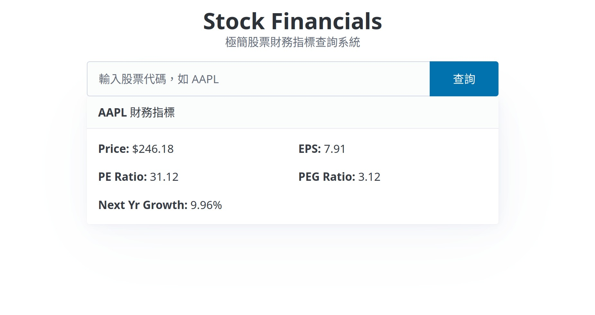

# Stock Financials API

使用 FastAPI 實作的服務，抓取股票數據、計算財務指標（PE/PEG）並儲存至 SQLite 資料庫。


## 設計決策

- **限流邏輯可以在測試中被替換**：將限流與防爬蟲寫成獨立的 `Depends`，測試時直接用空函式覆蓋，不用為了測試去修改業務邏輯
- **重複寫入不會產生髒資料**：資料庫用 `UNIQUE(date, symbol)` 加上 upsert，同一天同一支股票查兩次，只會更新而不會出現兩筆紀錄
- **網路錯誤和查無資料是不同的問題**：yfinance 內部問題回傳 502，股票代碼不存在才回傳 404，讓呼叫方知道是哪一層出了問題
- **外部 API 只在一個地方被呼叫**：所有 yfinance 的邏輯都集中在 `yfinance_fetcher.py`，測試時只需要在這個邊界 mock，不會影響到其他模組

## Roadmap

- 資料快取 (api)：先查詢資料庫是否已經存在「當天日期+股票代碼」的紀錄，若有則直接回傳，沒有才查詢API
- 更好的 API 安全 (api)：針對同一ip請求的rate limiting，使用slowapi 和 redis，或至少先在檔案做dict持久化。時間限制也應該做成 sliding window

## 啟動

1. 安裝依賴與環境
```bash
uv sync
```

2. 執行整合測試
```bash
uv run pytest
```

3. 啟動伺服器
```bash
uv run uvicorn app.api:app --reload
```

4. 使用 curl 測試
```bash
curl -H "User-Agent: Mozilla/5.0" http://127.0.0.1:8000/stock/aapl
```

## Docker

```bash
docker compose up -d
```

啟動後可至以下網址進行測試：

- 前端 UI 介面: http://127.0.0.1:8000/
- 後端 API 文件 (Swagger): http://127.0.0.1:8000/docs

## Tools

- 語言與環境: Python 3.13, uv
- 後端框架: FastAPI, Uvicorn
- 測試工具: pytest, unittest.mock
- 資料處理: yfinance, sqlite3

## Live Demo

因為 `yfinance` 依賴爬蟲機制，查詢時會因為 Yahoo Finance 的 IP 封鎖導致查詢失敗。

https://stock-financials-pzv1.onrender.com/